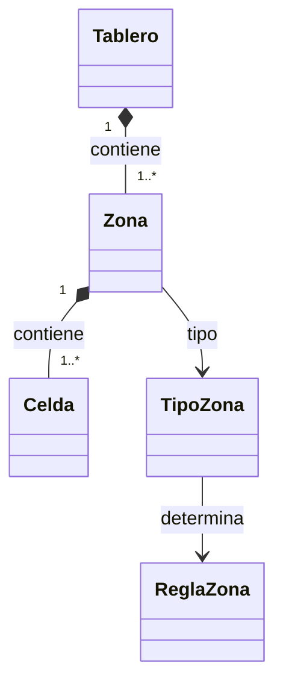

# Brilliant Game

Motor lógico en Dart organizado como **Tablero → Zona → Celda**. Esta etapa cubre la estructura del tablero y las restricciones de cinco colores.

## Modelo



- **Tablero**: tiene un ID y zonas. Comprueba que no haya zonas duplicadas, IDs de celda repetidos ni coordenadas superpuestas. Admite distintas formas y huecos; no fija dimensiones ni colores por posición.
- **Zona**: tiene un ID independiente del color (por ejemplo, `"2"`), un `TipoZona`, sus celdas y una referencia opcional `campoPuntuacion`. Gestiona los números y valida la regla antes de cambiarlos. Una zona completada tiene todas sus celdas ocupadas.
- **TipoZona**: representa el color y determina su regla. No se puede configurar un color con una regla contradictoria.
- **ReglaZona**: valida números de 1 a 6 y la restricción correspondiente. Rojo y amarillo son tipos distintos con la misma regla.
- **Celda**: representa ID, fila, columna, `esInicio` y valor opcional. Es inmutable; no duplica el color ni la pertenencia a una zona.

Los IDs de zona y celda son únicos **dentro de un tablero**, pero se pueden reutilizar en otros. Un tablero admite varias zonas del mismo color y cada una valida sus propios números. Para partidas independientes, construir nuevas instancias de `Zona`: sus valores son estado mutable y compartir una instancia compartiría ese estado.

## Tipos y reglas

| Tipo | Regla | Ejemplo válido | Ejemplo rechazado |
|---|---|---|---|
| Verde | Cualquier número entre 1 y 6 | 1, 6, 3, 3 | 7 |
| Azul | Todos iguales | 4, 4, 4 | 4, 5 |
| Rojo | Todos diferentes | 1, 2, 3 | 1, 2, 2 |
| Morado | Como máximo dos números distintos | 3, 5, 3 | 3, 5, 1 |
| Amarillo | Todos diferentes | 1, 2, 3 | 1, 2, 2 |

Una configuración sin números es válida. Una zona debe tener al menos una celda, y un tablero al menos una zona. `Zona.validarValores` comprueba además que los valores propuestos no excedan la capacidad de la zona. Naranja queda fuera de esta etapa.

## Uso

```dart
import 'package:brilliant_game/brilliant_game.dart';

final tablero = Tablero(
  id: 'nivel1',
  zonas: [
    Zona(
      id: '2',
      tipo: TipoZona.verde,
      celdas: [
        Celda(id: 'C1', fila: 0, columna: 0, esInicio: true),
        Celda(id: 'C2', fila: 1, columna: 0),
      ],
    ),
  ],
);

tablero.colocarValor('C1', 4);
tablero.colocarValor('C2', 2);
final valores = tablero.extraerValoresDeZona('2'); // [4, 2]
final completada = tablero.obtenerZona('2').estaCompletada; // true
final tipo = tablero.obtenerZonaDeCelda('C1').tipo; // TipoZona.verde

tablero.vaciarCelda('C1');
```

El ejemplo representa la arquitectura. **No es una transcripción de todas las casillas, zonas o puntuaciones de la fotografía.** Los números de zona son identificadores; no son valores de las celdas ni puntuaciones.

### Cambiar valores

Usar `Tablero.colocarValor`, `Zona.colocarValor` y sus métodos `vaciarCelda`. `puedeColocarValor` permite consultar sin modificar. Los valores inválidos y las referencias inexistentes generan `ArgumentError`; el rechazo no cambia el estado.

Se conserva la posibilidad anterior de **reemplazar** un número existente. La comprobación excluye su valor anterior antes de evaluar el nuevo. Esto permite editar el estado; no impone todavía prohibiciones de reemplazo propias de una partida.

`Celda.conValor` y `Celda.sinValor` devuelven copias independientes. Una referencia a una celda representa su estado en ese momento: volver a consultarla en el tablero después de una modificación. Las colecciones públicas no permiten añadir, eliminar o sustituir entradas. La estructura queda fijada al construir el tablero.

### Consultas conservadas

- `obtenerCeldaEn(fila, columna)`: devuelve la celda o `null` si no existe.
- `obtenerVecinos(celdaId)`: arriba, abajo, izquierda y derecha; también detecta vecinos de otras zonas. Devuelve `null` en huecos o bordes y no incluye diagonales.
- `extraerValoresDeZona(zonaId)`: devuelve los números ocupados en el orden de definición de las celdas.
- `celdas`: consulta derivada de las zonas; no es otra fuente de estado.
- Las funciones `cumpleReglaVerde`, `cumpleReglaAzul`, `cumpleReglaRojoAmarillo` y `cumpleReglaMorado` se conservan y delegan en `ReglaZona`.

## Estructura

```text
lib/
  brilliant_game.dart       Exportaciones públicas
  models/
    celda.dart              Casilla inmutable
    zona.dart               Casillas y operaciones de una zona
    tipo_zona.dart          Cinco colores y asociación con reglas
  core/
    reglas.dart             Implementación única de restricciones
    tablero.dart            Zonas, integridad y consultas espaciales
example/
  main.dart                 Demostración ejecutable
test/
  models/                   Pruebas de celdas y zonas
  core/                     Reglas y funcionamiento del tablero
```

## Migración desde la estructura anterior

Esta reestructuración cambia la API de construcción y colocación; los consumidores deben actualizarse.

| Antes | Ahora |
|---|---|
| `Area` en `models/area.dart` | `Zona` en `models/zona.dart` |
| `ReglaArea` | `ReglaZona`, obtenida desde `TipoZona.regla` |
| `color: 'verde'` y regla configurada por separado | `tipo: TipoZona.verde` |
| `Area.celdaIds` y mapa externo de celdas | `Zona(celdas: [...])` con objetos reales |
| `Celda.areaId` y `Celda.color` | `tablero.obtenerZonaDeCelda(id)` y `.tipo` |
| `Tablero(celdas: ..., areas: ...)` | `Tablero(id: ..., zonas: [...])` |
| `RegionBloque.azul1` | ID libre de zona, por ejemplo `'2'` |
| `extraerValoresDeBloque(region)` | `extraerValoresDeZona(zonaId)` |
| `celda.colocarValor(4)` | `tablero.colocarValor(celdaId, 4)` o `zona.colocarValor(celdaId, 4)` |
| `celda.vaciar()` | `tablero.vaciarCelda(celdaId)` o `zona.vaciarCelda(celdaId)` |
| Área completada por tener IDs | Zona completada cuando todas sus celdas tienen valor |

Las funciones de reglas ahora también rechazan valores fuera de 1–6. El código anterior que dependía de mutar mapas o listas directamente debe construir el tablero completo desde sus zonas.

## Ejecutar y verificar

Requiere Dart `>=3.9.0 <4.0.0`.

```sh
dart pub get
dart analyze
dart test
dart run example/main.dart
```

Validación de esta reestructuración con Dart 3.11.4: **56 pruebas aprobadas**, análisis estático sin incidencias y ejemplo ejecutado. Se conservaron las 20 pruebas de las funciones de reglas y se adaptaron o añadieron las de modelos, zonas e integridad.

## Alcance pendiente

`esInicio` y `campoPuntuacion` conservan su información, pero no implementan reglas de inicio ni cálculo de puntos. Tampoco se imponen conectividad geométrica de las zonas, turnos, dados, restricciones de adyacencia al colocar, final de partida, persistencia o interfaz gráfica. Son responsabilidades posteriores; esta etapa garantiza pertenencia, posiciones no superpuestas y restricciones de color.
